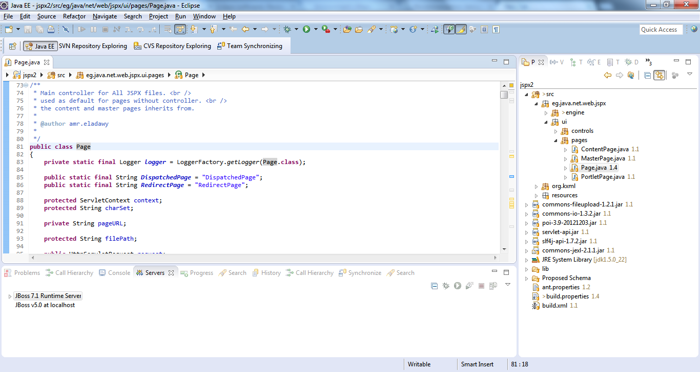

# Accessible Design Knowledge

* More design knowledge should be published
* Published design knowledge needs to be in a proper format

This does not only benefit other designers; it also benefits the institutions involved and, most importantly, society.

* * *

# Inspiration

* Open Source
* Open Knowledge
* Open Patenting
* Open Innovation
* ~~Open Design~~

* * *

# Non-design examples

* It’s really to distinguish between design and non-design.
* The following are more technology- and business-driven.
* Good examples, bad examples.

* * *

## Eclipse

* Open Source
* Eclipse Foundation: A consortium of companies, institutions and individuals who have an interest in Eclipse
* Collaborate on the technology, compete on products
* IBM’s RAD & Lotus Notes, Googles Android SDK, Adobe ColdFusion… Support & Services

* * *

## Patents

* Tesla releases patents to the public
* Open Invention Network, *a shared defensive patent pool with the mission to protect Linux*
* Quirky Inspiration Platform: Quirky users can search for and use GE patents in their inventions

* * *

# Design examples

Getting there…

* * *

## Fairphone

How to make a phone that respects the environment and human rights?

* Transparency (cost breakdown, suppliers, social assessment report)
* Roadmap
* Design challenges (e.g. 3d printed cases)
* Repair, recycle if possible
* Fairphone Pop-Up Space
* [Blog](http://www.fairphone.com/2015/02/12/our-approach-to-developing-the-next-fairphone/) & (Kwamecorp: Fairphone OS)

* * *

## Lindängen Library

* We used a *paper cup* ideation method, and it served us really well
* It was inspired by a workshop by *Unsworn Industries* with Malmö Library during Dar’s TP1
* Dar had lots of documentation from the past project, but was not sure if we were allowed to use it

* * *

## Building theguardian.com

* *Inside the Guardian* blog
* Talks
* Styleguide
* Open Source repository
* Interviews, articles in other media

Still, too tech-oriented

* * *

## Multitouch Interface (Jeff Han)

* Research & Design at NYU
* Founded *Perceptive Pixel* startup
* Got acquired by Microsoft
* No academic papers after 2009, but continues to publish patents

* * *

# What can we do?

**Change of mind**:

* While publishing our knowledge we can still stay competitive
* Publishing knowledge benefits us and others
* Stealing is not enough

* * *

# But isn’t that a lot of effort?

* * *

# We need an effortless, natural way to publish design knowledge as we go

* Integrated in practice.
* Communicate through your medium (developers through code, designers through…artefacts? post-it notes? drawings? videos?)
* More *why* in addition to the *what*
* Blog posts, artificial documentation, specs don’t help much